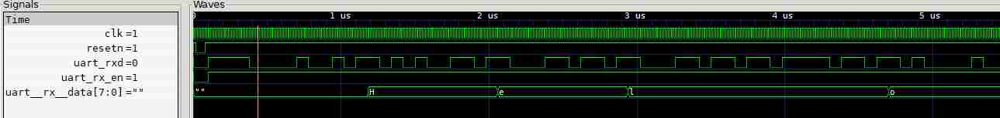

#### [nmigen-yosim](https://github.com/andresdemski/nmigen-yosim)

Verilog/vhdl simulation based on yosys C++ generation with testbenches 
written in python. The API is inspired by COCOTB.

###### This fork has the following minor changes:

- using verilog instead nmigen as input format

- mingw compatible python configuration

- removal of nmigen dependency

- parsing of inputs to handler_list added

- example uart.py added:

Cxxrtl does not like processes with multiple edges in the sensitivity list ..
